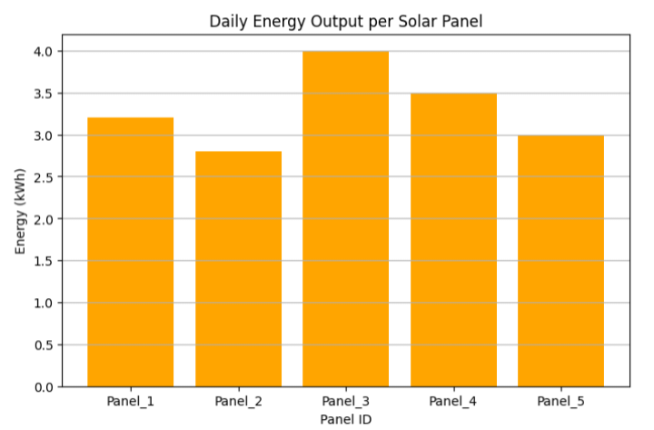
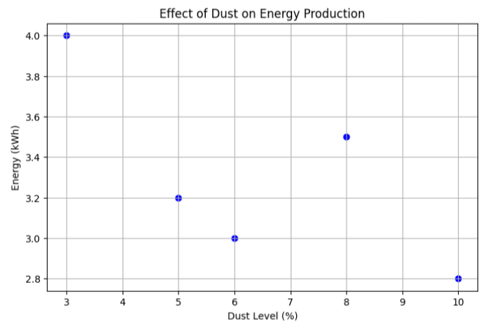

# Solar Energy Analyzer (SEA)

This project simulates a small solar panel station and analyzes daily energy output using Python.

## Visualization Results



## Project Features
- Calculate average energy per solar panel.
- Identify the panel with the highest and lowest energy output.
- Bar chart showing daily energy output for each panel.
- Scatter plot showing the effect of dust on energy production.

## Tools Used
- Python 3
- pandas
- matplotlib

## Sample Data
Sample data for a small station with 5 solar panels, including dust level and sun hours per day.

## How to Run
1. Install required libraries:
```bash
pip install pandas matplotlib
```
2. Run the program:
```bash
python solar_analyzer.py
```

## Output
- **energy_bar_chart.png:** Shows daily energy output per panel.
- **dust_vs_energy.png:** Shows the effect of dust on energy production.

> This project demonstrates data analysis and visualization skills applied to a real-world problem in sustainable energy.
## Author
Mohammed Alozeib
